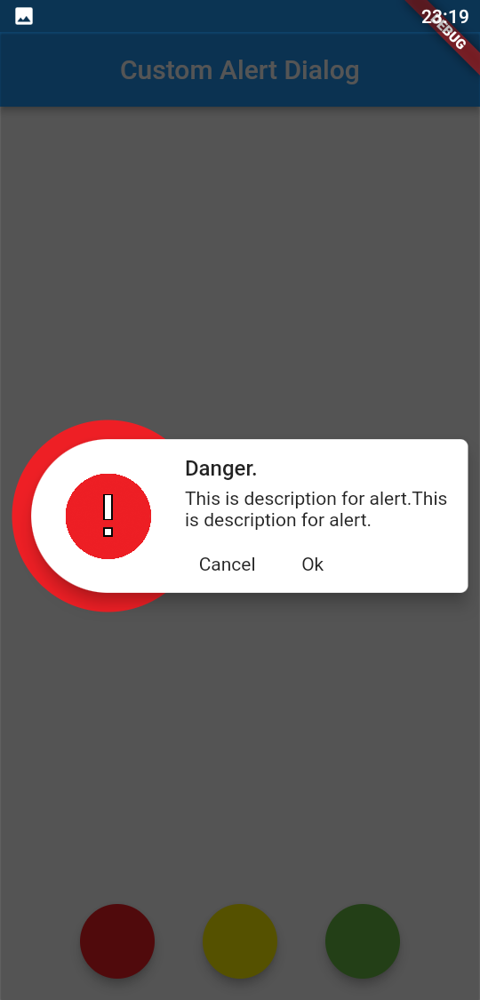
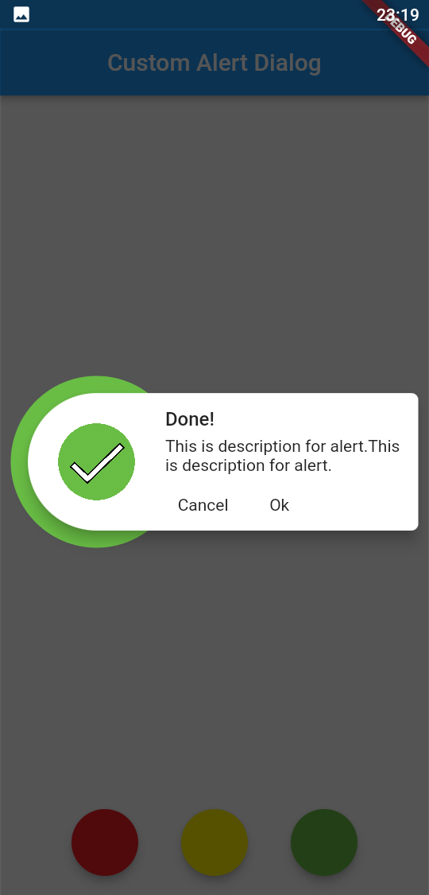
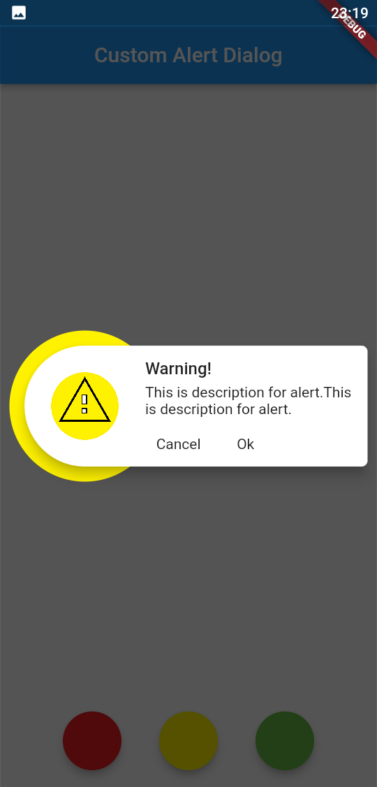
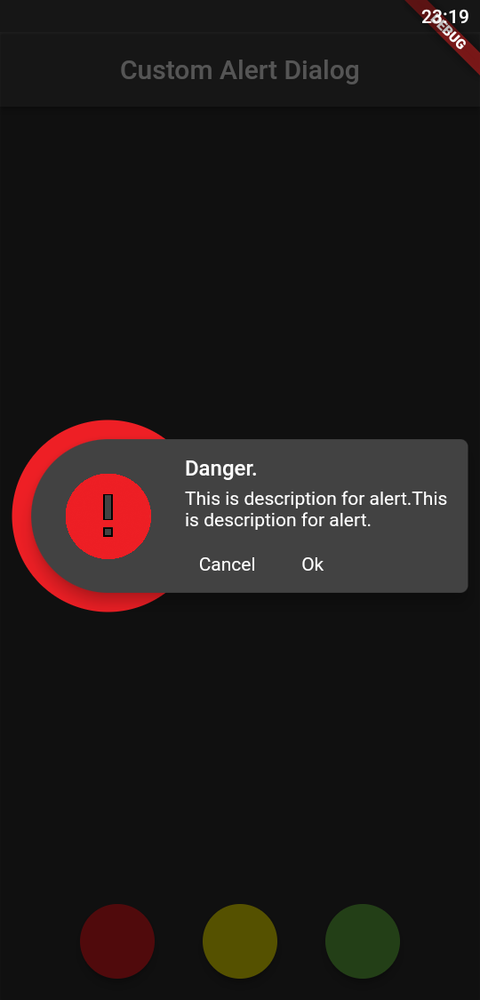
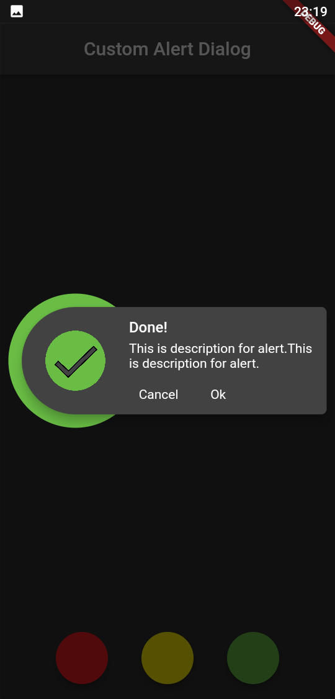
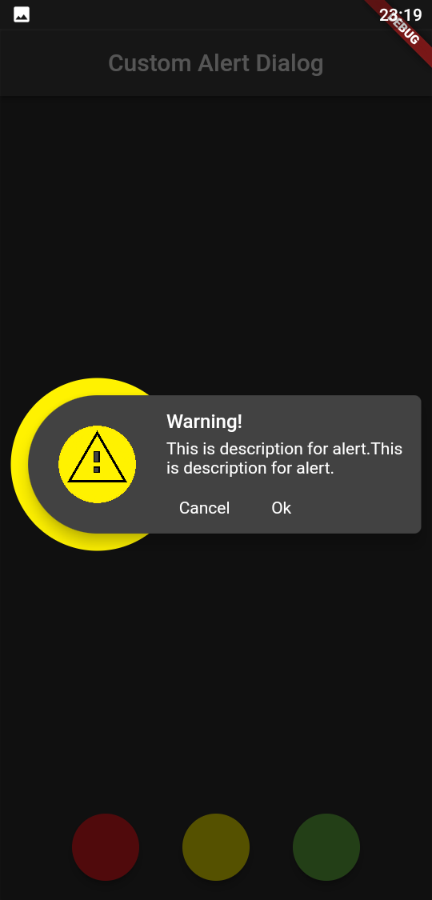

# Custom Dialog

In this project, a custom dialog widget was designed.

## Usage

```
ShowCustomDialog(
                context: context,
                title: "Warning!",
                description: "This is description for alert.This is description for alert.",
                dialogType: DialogType.warning,
                okFunction: () {},
                cancelFunction: () {},
              );
```

You can choose 3 types of dialogue types. These: Danger, Warning And Done.

## Light Theme

<br>
<p float="left">
  
  
  
</p>
<br>

## Dark Theme

<br>
<p float="left">
  
  
  
</p>
<br>
